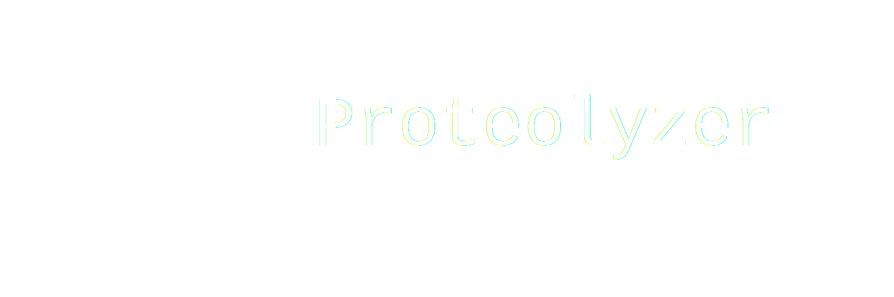

---------

[](https://github.com/OrhunKok/proteolyzer/actions/workflows/ruff.yml)

# Proteolyzer

Proteolyzer is a Python package designed for processing, analyzing, and visualizing proteomics data. It provides utilities for data loading, processing, transformation, and visualization, making it easier to work with complex proteomics datasets.

## Features

- **Data Loading**: Load data from various formats, including Parquet and Excel.
- **Data Processing**: Clean and structure raw proteomics data for downstream analysis.
- **Matrix Transformation**: Build matrices for statistical and machine learning workflows.
- **Custom Logging**: Integrated logging for better traceability and debugging.
- **Unimod Integration**: Retrieves and organizes the UniMod Database
- **CellenOne Module**: Maps single-cells prepared via cellenOne to well positions.
- **Alternate RNA Decoding Module**: Implementation of the pipeline used for discovery of amino acid substitutions and PTMs. [Paper](https://decode.slavovlab.net/).

## Installation

1. Clone the repository:
   ```bash
   git clone <repository-url>
   cd proteolyzer
   ```

2. Install the package and its dependencies:
   ```bash
   pip install .
   ```

3. Alternatively, install the package in editable mode for development:
   ```bash
   pip install -e .
   ```

## Contributing

Contributions are welcome! If you'd like to contribute, please fork the repository, make your changes, and submit a pull request. Ensure that your code passes all tests and follows the project's coding standards.
